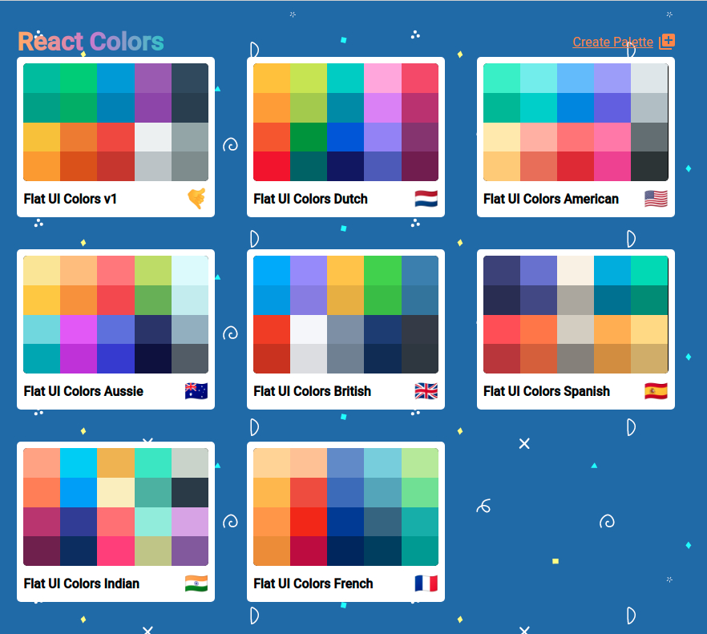
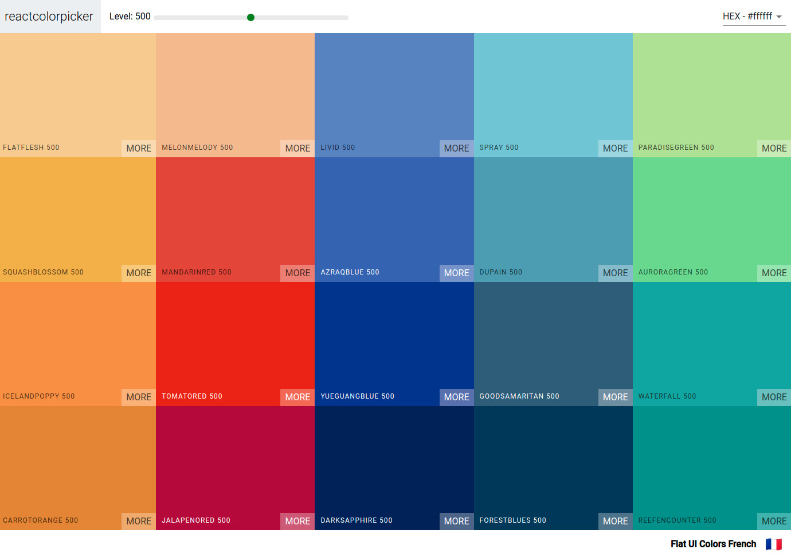

# react-colors
React-colors - is a project with ...
Nice and responsive

# Features

### Main page
Here you can:  
* Delete color palettes  
* Create own color palettes  
* View a certain palette  

### New Palette Form
Here you can:
* Create own color using Color Picker
* Re-order Colors By Drag&Drop
* Get Random Colors
* Delete Colors
* Save whole palette

> Also there are bunch of Validations here: color value, color name, max number of colors, palette name.

### Certain Palette
Here you can:
* Copy colors to clipboard
* Chenge color format (HEX, RGB, RGBA)
* Change Lightness(shades) of Color 
* View all shades of certain color

### Certain Color Shades
Here you can:
* Copy colors to clipboard
* Chenge color format (HEX, RGB, RGBA)

## Goal
I did it so that I could learn enough about authentication and authorization with JWT tokens, mastering the Redux concepts, localStorage, async API call and others...

## Tech Stack & Technologies
 * React
 * Material UI
 * JSS
 * chroma.js
And othe libraries to implement: Drag&Drop, Copy to Clipboard, Form Validation, Color Picker, Emoji Picker and more ...
